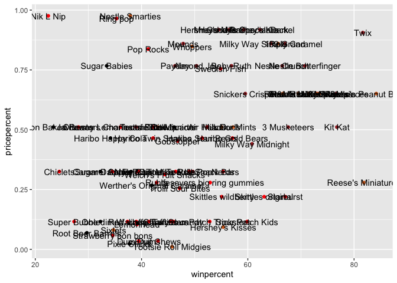
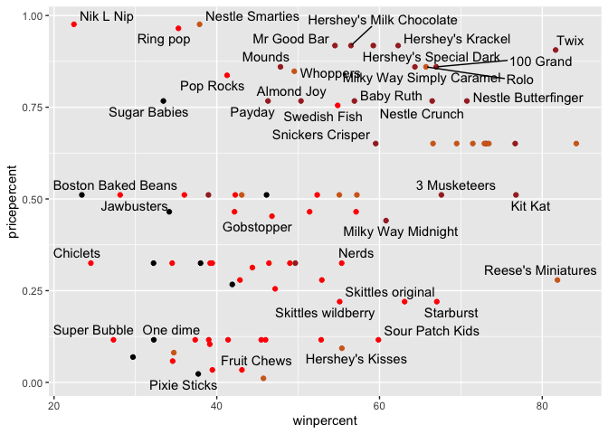
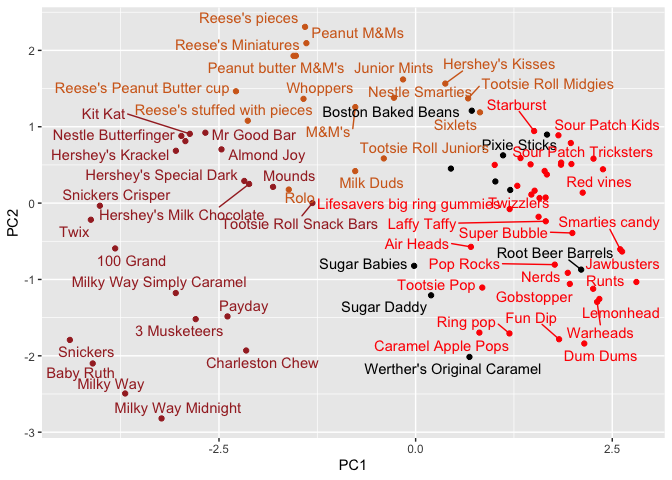

# Class10: Halloween mini project
Junlin Ruan (PID: A17839687)

- [Background](#background)
- [Data Export](#data-export)
- [Quick overview of the dataset](#quick-overview-of-the-dataset)
- [Overall Candy Ranking](#overall-candy-ranking)
- [Winpercent and Pricepercent](#winpercent-and-pricepercent)
- [Exploring the correlation
  structure](#exploring-the-correlation-structure)
- [Principal Component Analysis](#principal-component-analysis)

## Background

As it is nearly Halloween and the half way point in the quarter let’s do
a mini project that help us figure out the best candy!

Our data come from the 538 website and is available as a CSV file:

## Data Export

``` r
candy <- read.csv("candy-data.txt", row.names = 1)
head(candy)
```

                 chocolate fruity caramel peanutyalmondy nougat crispedricewafer
    100 Grand            1      0       1              0      0                1
    3 Musketeers         1      0       0              0      1                0
    One dime             0      0       0              0      0                0
    One quarter          0      0       0              0      0                0
    Air Heads            0      1       0              0      0                0
    Almond Joy           1      0       0              1      0                0
                 hard bar pluribus sugarpercent pricepercent winpercent
    100 Grand       0   1        0        0.732        0.860   66.97173
    3 Musketeers    0   1        0        0.604        0.511   67.60294
    One dime        0   0        0        0.011        0.116   32.26109
    One quarter     0   0        0        0.011        0.511   46.11650
    Air Heads       0   0        0        0.906        0.511   52.34146
    Almond Joy      0   1        0        0.465        0.767   50.34755

``` r
library(flextable)
flextable::flextable(head(candy, 10))
```


> Q1. How many different candy types are in this dataset?

``` r
nrow(candy)
```

    [1] 85

``` r
candy |>
  nrow()
```

    [1] 85

``` r
library(tidyverse)
```

    ── Attaching core tidyverse packages ──────────────────────── tidyverse 2.0.0 ──
    ✔ dplyr     1.1.4     ✔ readr     2.1.5
    ✔ forcats   1.0.1     ✔ stringr   1.5.2
    ✔ ggplot2   4.0.0     ✔ tibble    3.3.0
    ✔ lubridate 1.9.4     ✔ tidyr     1.3.1
    ✔ purrr     1.1.0     
    ── Conflicts ────────────────────────────────────────── tidyverse_conflicts() ──
    ✖ purrr::compose() masks flextable::compose()
    ✖ dplyr::filter()  masks stats::filter()
    ✖ dplyr::lag()     masks stats::lag()
    ℹ Use the conflicted package (<http://conflicted.r-lib.org/>) to force all conflicts to become errors

``` r
candy %>%
  nrow()
```

    [1] 85

> Q2. How many fruity candy types are in the dataset?

``` r
sum(candy$fruity)
```

    [1] 38

My favorite winpercent

``` r
library(dplyr)

candy |>
  filter(rownames(candy) == "Almond Joy") |>
  select(winpercent)
```

               winpercent
    Almond Joy   50.34755

``` r
candy["Twix", ]$winpercent
```

    [1] 81.64291

> Q3. What is your favorite candy in the dataset and what is it’s
> winpercent value?

``` r
candy["Air Head", ]$winpercent
```

    [1] 52.34146

> Q4. What is the winpercent value for “Kit Kat”?

``` r
candy["Kit Kat", ]$winpercent
```

    [1] 76.7686

> Q5. What is the winpercent value for “Tootsie Roll Snack Bars”?

``` r
candy["Toostie Roll Snack Bars", ]$winpercent
```

    [1] NA

## Quick overview of the dataset

``` r
library("skimr")
skimr::skim(candy)
```

|                                                  |       |
|:-------------------------------------------------|:------|
| Name                                             | candy |
| Number of rows                                   | 85    |
| Number of columns                                | 12    |
| \_\_\_\_\_\_\_\_\_\_\_\_\_\_\_\_\_\_\_\_\_\_\_   |       |
| Column type frequency:                           |       |
| numeric                                          | 12    |
| \_\_\_\_\_\_\_\_\_\_\_\_\_\_\_\_\_\_\_\_\_\_\_\_ |       |
| Group variables                                  | None  |

Data summary

**Variable type: numeric**

| skim_variable | n_missing | complete_rate | mean | sd | p0 | p25 | p50 | p75 | p100 | hist |
|:---|---:|---:|---:|---:|---:|---:|---:|---:|---:|:---|
| chocolate | 0 | 1 | 0.44 | 0.50 | 0.00 | 0.00 | 0.00 | 1.00 | 1.00 | ▇▁▁▁▆ |
| fruity | 0 | 1 | 0.45 | 0.50 | 0.00 | 0.00 | 0.00 | 1.00 | 1.00 | ▇▁▁▁▆ |
| caramel | 0 | 1 | 0.16 | 0.37 | 0.00 | 0.00 | 0.00 | 0.00 | 1.00 | ▇▁▁▁▂ |
| peanutyalmondy | 0 | 1 | 0.16 | 0.37 | 0.00 | 0.00 | 0.00 | 0.00 | 1.00 | ▇▁▁▁▂ |
| nougat | 0 | 1 | 0.08 | 0.28 | 0.00 | 0.00 | 0.00 | 0.00 | 1.00 | ▇▁▁▁▁ |
| crispedricewafer | 0 | 1 | 0.08 | 0.28 | 0.00 | 0.00 | 0.00 | 0.00 | 1.00 | ▇▁▁▁▁ |
| hard | 0 | 1 | 0.18 | 0.38 | 0.00 | 0.00 | 0.00 | 0.00 | 1.00 | ▇▁▁▁▂ |
| bar | 0 | 1 | 0.25 | 0.43 | 0.00 | 0.00 | 0.00 | 0.00 | 1.00 | ▇▁▁▁▂ |
| pluribus | 0 | 1 | 0.52 | 0.50 | 0.00 | 0.00 | 1.00 | 1.00 | 1.00 | ▇▁▁▁▇ |
| sugarpercent | 0 | 1 | 0.48 | 0.28 | 0.01 | 0.22 | 0.47 | 0.73 | 0.99 | ▇▇▇▇▆ |
| pricepercent | 0 | 1 | 0.47 | 0.29 | 0.01 | 0.26 | 0.47 | 0.65 | 0.98 | ▇▇▇▇▆ |
| winpercent | 0 | 1 | 50.32 | 14.71 | 22.45 | 39.14 | 47.83 | 59.86 | 84.18 | ▃▇▆▅▂ |

> Q6. Is there any variable/column that looks to be on a different scale
> to the majority of the other columns in the dataset?

The winpercent is on a 0-100 scale the rest are 0-1 scale

> Q7. What do you think a zero and one represent for the
> candy\$chocolate column?

That the candy does not contain chocolate

> Q8. Plot a histogram of winpercent values

``` r
library(ggplot2)

ggplot(candy) +
  aes(winpercent) +
  geom_histogram(bins = 20)
```


> Q9. Is the distribution of winpercent values symmetrical?

``` r
ggplot(candy) +
  aes(winpercent) +
  geom_density()
```


> Q10. Is the center of the distribution above or below 50%?

``` r
mean(candy$winpercent)
```

    [1] 50.31676

``` r
summary(candy$winpercent)
```

       Min. 1st Qu.  Median    Mean 3rd Qu.    Max. 
      22.45   39.14   47.83   50.32   59.86   84.18 

> Q11. On average is chocolate candy higher or lower ranked than fruit
> candy?

``` r
# 1. Find all chocolate candy in the data set
# 2. Find their winpercent values
# 3. Calculate the mean of these values

# 4-6. Do the same for fruity candy
# 7. Compare mean winpercents of chocolate vs fruity
# 8. Pick the highest as the winner

choc.inds <- candy$chocolate == 1
choc.win <- candy[choc.inds, ]$winpercent
choc.mean <- mean(choc.win)
choc.mean
```

    [1] 60.92153

``` r
mean(candy[candy$chocolate==1,]$winpercent)
```

    [1] 60.92153

``` r
mean(candy[candy$fruity==1,]$winpercent)
```

    [1] 44.11974

``` r
frut.ind <- candy$fruity==1
frut.win <- candy[frut.ind,]$winpercent
frut.mean <- mean(frut.win)
frut.mean
```

    [1] 44.11974

``` r
candy |>
  filter(chocolate==1) |>
  select(winpercent) 
```

                                winpercent
    100 Grand                     66.97173
    3 Musketeers                  67.60294
    Almond Joy                    50.34755
    Baby Ruth                     56.91455
    Charleston Chew               38.97504
    Hershey's Kisses              55.37545
    Hershey's Krackel             62.28448
    Hershey's Milk Chocolate      56.49050
    Hershey's Special Dark        59.23612
    Junior Mints                  57.21925
    Kit Kat                       76.76860
    Peanut butter M&M's           71.46505
    M&M's                         66.57458
    Milk Duds                     55.06407
    Milky Way                     73.09956
    Milky Way Midnight            60.80070
    Milky Way Simply Caramel      64.35334
    Mounds                        47.82975
    Mr Good Bar                   54.52645
    Nestle Butterfinger           70.73564
    Nestle Crunch                 66.47068
    Peanut M&Ms                   69.48379
    Reese's Miniatures            81.86626
    Reese's Peanut Butter cup     84.18029
    Reese's pieces                73.43499
    Reese's stuffed with pieces   72.88790
    Rolo                          65.71629
    Sixlets                       34.72200
    Nestle Smarties               37.88719
    Snickers                      76.67378
    Snickers Crisper              59.52925
    Tootsie Pop                   48.98265
    Tootsie Roll Juniors          43.06890
    Tootsie Roll Midgies          45.73675
    Tootsie Roll Snack Bars       49.65350
    Twix                          81.64291
    Whoppers                      49.52411

> Q12. Is this difference statistically significant?

``` r
t.test(choc.win, frut.win)
```


        Welch Two Sample t-test

    data:  choc.win and frut.win
    t = 6.2582, df = 68.882, p-value = 2.871e-08
    alternative hypothesis: true difference in means is not equal to 0
    95 percent confidence interval:
     11.44563 22.15795
    sample estimates:
    mean of x mean of y 
     60.92153  44.11974 

## Overall Candy Ranking

> Q13. What are the five least liked candy types in this set?

``` r
candy |>
  arrange(winpercent) |>
  head(5)
```

                       chocolate fruity caramel peanutyalmondy nougat
    Nik L Nip                  0      1       0              0      0
    Boston Baked Beans         0      0       0              1      0
    Chiclets                   0      1       0              0      0
    Super Bubble               0      1       0              0      0
    Jawbusters                 0      1       0              0      0
                       crispedricewafer hard bar pluribus sugarpercent pricepercent
    Nik L Nip                         0    0   0        1        0.197        0.976
    Boston Baked Beans                0    0   0        1        0.313        0.511
    Chiclets                          0    0   0        1        0.046        0.325
    Super Bubble                      0    0   0        0        0.162        0.116
    Jawbusters                        0    1   0        1        0.093        0.511
                       winpercent
    Nik L Nip            22.44534
    Boston Baked Beans   23.41782
    Chiclets             24.52499
    Super Bubble         27.30386
    Jawbusters           28.12744

``` r
x <- c(5,1,10,4)
#sort(x)
order(x)
```

    [1] 2 4 1 3

``` r
#order(candy$winpercent)
```

``` r
ord.ind <- order(candy$winpercent)
head(candy[ord.ind,], 5)
```

                       chocolate fruity caramel peanutyalmondy nougat
    Nik L Nip                  0      1       0              0      0
    Boston Baked Beans         0      0       0              1      0
    Chiclets                   0      1       0              0      0
    Super Bubble               0      1       0              0      0
    Jawbusters                 0      1       0              0      0
                       crispedricewafer hard bar pluribus sugarpercent pricepercent
    Nik L Nip                         0    0   0        1        0.197        0.976
    Boston Baked Beans                0    0   0        1        0.313        0.511
    Chiclets                          0    0   0        1        0.046        0.325
    Super Bubble                      0    0   0        0        0.162        0.116
    Jawbusters                        0    1   0        1        0.093        0.511
                       winpercent
    Nik L Nip            22.44534
    Boston Baked Beans   23.41782
    Chiclets             24.52499
    Super Bubble         27.30386
    Jawbusters           28.12744

> Q14. What are the top 5 all time favorite candy types out of this set?

``` r
candy |>
  arrange(winpercent) |>
  tail(5)
```

                              chocolate fruity caramel peanutyalmondy nougat
    Snickers                          1      0       1              1      1
    Kit Kat                           1      0       0              0      0
    Twix                              1      0       1              0      0
    Reese's Miniatures                1      0       0              1      0
    Reese's Peanut Butter cup         1      0       0              1      0
                              crispedricewafer hard bar pluribus sugarpercent
    Snickers                                 0    0   1        0        0.546
    Kit Kat                                  1    0   1        0        0.313
    Twix                                     1    0   1        0        0.546
    Reese's Miniatures                       0    0   0        0        0.034
    Reese's Peanut Butter cup                0    0   0        0        0.720
                              pricepercent winpercent
    Snickers                         0.651   76.67378
    Kit Kat                          0.511   76.76860
    Twix                             0.906   81.64291
    Reese's Miniatures               0.279   81.86626
    Reese's Peanut Butter cup        0.651   84.18029

``` r
candy |>
  arrange(-winpercent) |>
  head(5)
```

                              chocolate fruity caramel peanutyalmondy nougat
    Reese's Peanut Butter cup         1      0       0              1      0
    Reese's Miniatures                1      0       0              1      0
    Twix                              1      0       1              0      0
    Kit Kat                           1      0       0              0      0
    Snickers                          1      0       1              1      1
                              crispedricewafer hard bar pluribus sugarpercent
    Reese's Peanut Butter cup                0    0   0        0        0.720
    Reese's Miniatures                       0    0   0        0        0.034
    Twix                                     1    0   1        0        0.546
    Kit Kat                                  1    0   1        0        0.313
    Snickers                                 0    0   1        0        0.546
                              pricepercent winpercent
    Reese's Peanut Butter cup        0.651   84.18029
    Reese's Miniatures               0.279   81.86626
    Twix                             0.906   81.64291
    Kit Kat                          0.511   76.76860
    Snickers                         0.651   76.67378

> Q15. Make a first barplot of candy ranking based on winpercent values.

``` r
ggplot(candy) +
  aes(winpercent, rownames(candy)) + 
  geom_col()
```


> Q16. This is quite ugly, use the reorder() function to get the bars
> sorted by winpercent?

``` r
ggplot(candy) +
  aes(x = winpercent, 
      y = reorder(rownames(candy), winpercent)) + 
  geom_col()
```


Add some color based on the “type” of candy

``` r
my_cols <- rep("black", nrow(candy))
my_cols[as.logical(candy$chocolate)] <- "chocolate"
my_cols[as.logical(candy$fruity)] <- "pink"
my_cols[as.logical(candy$bar)] <- "brown"
my_cols
```

     [1] "brown"     "brown"     "black"     "black"     "pink"      "brown"    
     [7] "brown"     "black"     "black"     "pink"      "brown"     "pink"     
    [13] "pink"      "pink"      "pink"      "pink"      "pink"      "pink"     
    [19] "pink"      "black"     "pink"      "pink"      "chocolate" "brown"    
    [25] "brown"     "brown"     "pink"      "chocolate" "brown"     "pink"     
    [31] "pink"      "pink"      "chocolate" "chocolate" "pink"      "chocolate"
    [37] "brown"     "brown"     "brown"     "brown"     "brown"     "pink"     
    [43] "brown"     "brown"     "pink"      "pink"      "brown"     "chocolate"
    [49] "black"     "pink"      "pink"      "chocolate" "chocolate" "chocolate"
    [55] "chocolate" "pink"      "chocolate" "black"     "pink"      "chocolate"
    [61] "pink"      "pink"      "chocolate" "pink"      "brown"     "brown"    
    [67] "pink"      "pink"      "pink"      "pink"      "black"     "black"    
    [73] "pink"      "pink"      "pink"      "chocolate" "chocolate" "brown"    
    [79] "pink"      "brown"     "pink"      "pink"      "pink"      "black"    
    [85] "chocolate"

``` r
ggplot(candy) + 
  aes(winpercent, reorder(rownames(candy),winpercent)) +
  geom_col(fill=my_cols) 
```


> Q17. What is the worst ranked chocolate candy?

Sixlets \>Q18. What is the best ranked fruity candy?

Starburst

## Winpercent and Pricepercent

A plot with both variables/columns winpercent and pricepercent

``` r
my_cols[as.logical(candy$fruity)] <- "red"
ggplot(candy) +
  aes(x = winpercent, 
      y = pricepercent, 
      label = rownames(candy)) + 
  geom_point(col=my_cols) +
  geom_text()
```



``` r
library(ggrepel)
my_cols[as.logical(candy$fruity)] <- "red"
ggplot(candy) +
  aes(x = winpercent, 
      y = pricepercent, 
      label = rownames(candy)) + 
  geom_point(col=my_cols) +
  geom_text_repel(max.overlaps = 7)
```

    Warning: ggrepel: 45 unlabeled data points (too many overlaps). Consider
    increasing max.overlaps



> Q19. Which candy type is the highest ranked in terms of winpercent for
> the least money - i.e. offers the most bang for your buck?

Reese’s Miniatures \> Q20. What are the top 5 most expensive candy types
in the dataset and of these which is the least popular?

``` r
ord <- order(candy$pricepercent, decreasing = TRUE)
head(candy[ord, c(1, 11, 12)], n = 5)
```

                             chocolate pricepercent winpercent
    Nik L Nip                        0        0.976   22.44534
    Nestle Smarties                  1        0.976   37.88719
    Ring pop                         0        0.965   35.29076
    Hershey's Krackel                1        0.918   62.28448
    Hershey's Milk Chocolate         1        0.918   56.49050

## Exploring the correlation structure

Now that we’ve explored the dataset a little, we’ll see how the
variables interact with one another. We’ll use correlation and view the
results with the corrplot package to plot a correlation matrix.

``` r
library(corrplot)
```

    corrplot 0.95 loaded

``` r
cij <- cor(candy)
corrplot(cij)
```


> Q22. Examining this plot what two variables are anti-correlated
> (i.e. have minus values)?

fruity and chocolate \> Q23. Similarly, what two variables are most
positively correlated?

winpercent and chocolate

## Principal Component Analysis

The function to use is called `prcomp()` with an optional `scale=T/F`
argument.

``` r
pca <- prcomp(candy, scale = TRUE)
summary(pca)
```

    Importance of components:
                              PC1    PC2    PC3     PC4    PC5     PC6     PC7
    Standard deviation     2.0788 1.1378 1.1092 1.07533 0.9518 0.81923 0.81530
    Proportion of Variance 0.3601 0.1079 0.1025 0.09636 0.0755 0.05593 0.05539
    Cumulative Proportion  0.3601 0.4680 0.5705 0.66688 0.7424 0.79830 0.85369
                               PC8     PC9    PC10    PC11    PC12
    Standard deviation     0.74530 0.67824 0.62349 0.43974 0.39760
    Proportion of Variance 0.04629 0.03833 0.03239 0.01611 0.01317
    Cumulative Proportion  0.89998 0.93832 0.97071 0.98683 1.00000

Our main PCA result figure

``` r
ggplot(pca$x) +
  aes(PC1, PC2, label = rownames(pca$x)) +
  geom_point(col = my_cols) +
  geom_text_repel(col = my_cols)
```

    Warning: ggrepel: 21 unlabeled data points (too many overlaps). Consider
    increasing max.overlaps



We should also examine the variable “loading” or contributions of the
original variables to the new PCs

``` r
ggplot(pca$rotation) +
  aes(PC1, rownames(pca$rotation)) +
  geom_col()
```


``` r
p <- ggplot(pca$x) +
  aes(PC1, PC2, label = rownames(pca$x)) +
  geom_point(col = my_cols) +
  geom_text_repel(col = my_cols)
```

Interactive plots that can be zoomed on and “brushed” over can be made
with the **plotly** package. Its output is interactive and will not
render to PDF :-(

``` r
library(plotly)
```


    Attaching package: 'plotly'

    The following object is masked from 'package:ggplot2':

        last_plot

    The following objects are masked from 'package:flextable':

        highlight, style

    The following object is masked from 'package:stats':

        filter

    The following object is masked from 'package:graphics':

        layout

``` r
#ggplotly(p)
```

> Q24. What original variables are picked up strongly by PC1 in the
> positive direction? Do these make sense to you?

PC1 picked up “fruity”, “hard”, “pluribus” in the positive direction. It
makes sense as it picks up candies that fall into these categories.
