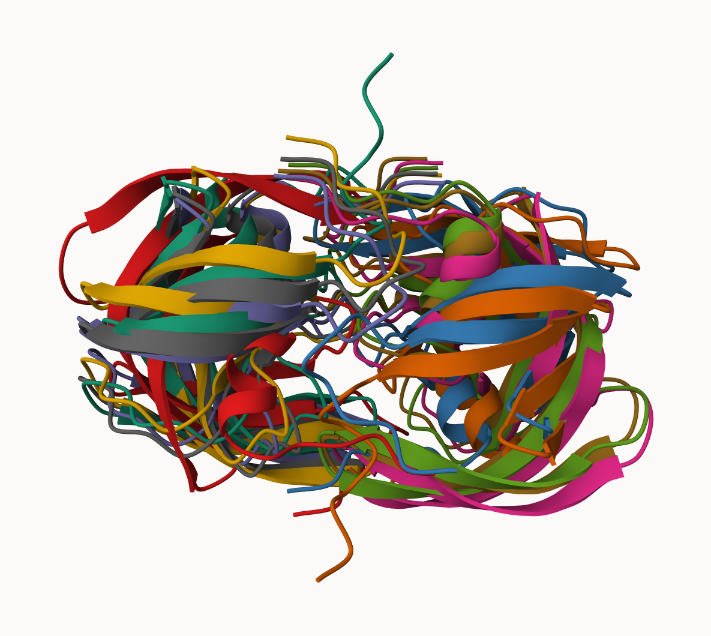
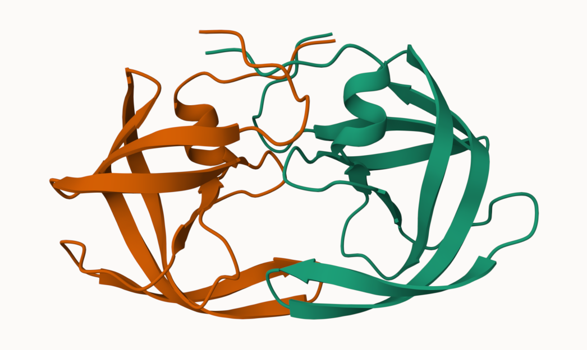
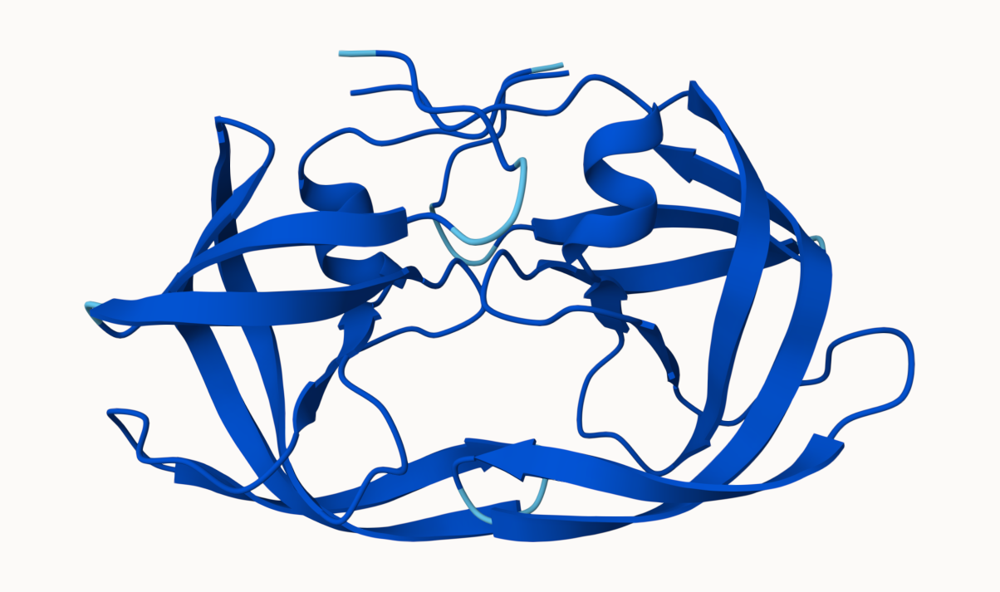
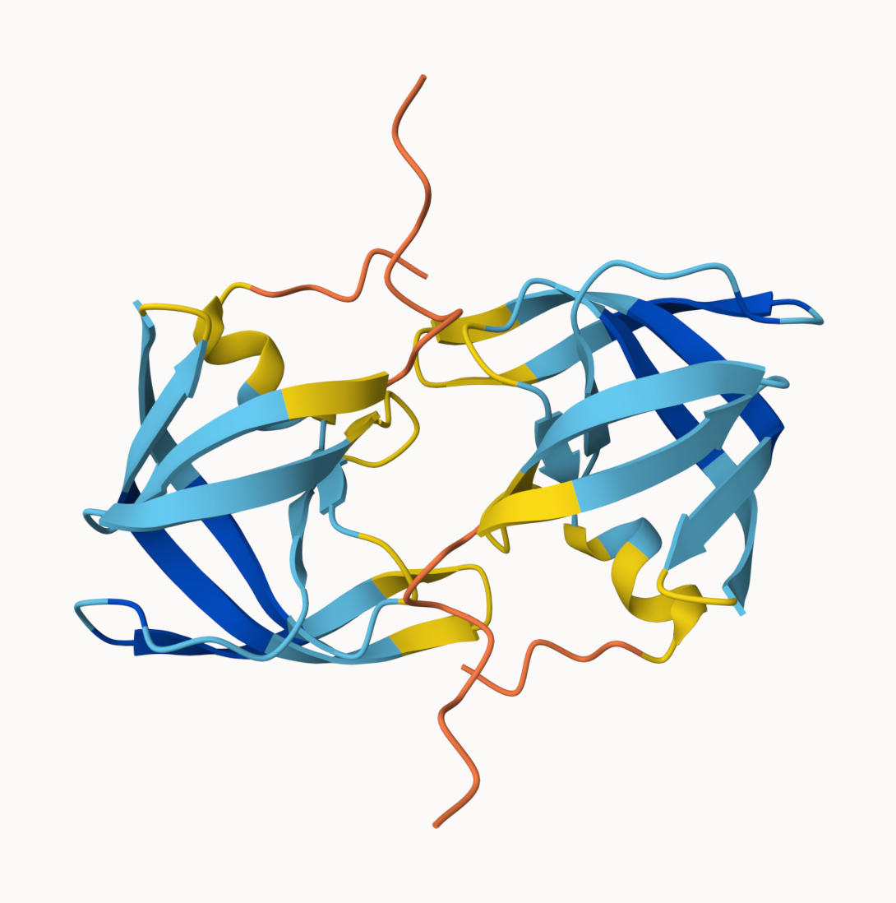
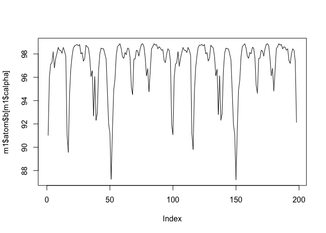
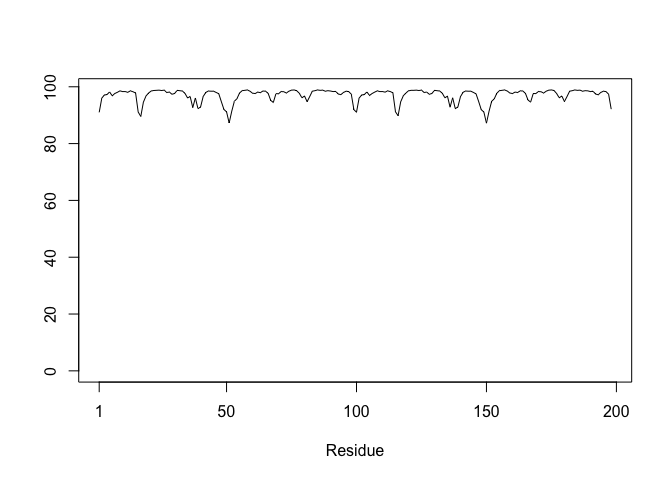

# Class 11: Structural Bioinformatics pt2
Junlin Ruan (PID: A17839687)

## AlphaFold DB

The EBI maintains the largest database of AlphaFold structure prediction
models at: https://alphafold.ebi.ac.uk

From last class (before Halloween) we saw that the PDB had 244,290 (Oct
2025)

The total number of protein sequences in UniProtKB is 199,579,901

> **Key Point**: This is a tiny fraction of sequence space that has
> structural coverage (0.12%)

``` r
244290/199579901 * 100
```

    [1] 0.1224021

AFDB is attempting to address this gap…

There are two “Quality Scpres” from AlphaFold: one for residues
(i.e. each amino acid) called **pLDDT** score, the other **PAE** score
measures the confidence in the relative position of the residues
(i.e.every pair of residues).

## Generating your own structure predictions

Image of all 5 models



Image of 1st models



pLDDT score of 1st model



pLDDT score of 5th model



# Custom analysis of resulting models in R

Read key result files into R. The first thing I need to know is what my
results directory/folder is called (i.e. it name is different for every
AlphaFold run/job)

``` r
results_dir <- "HIVPR_Dimer_23119/"

# File names for all PDB models
pdb_files <- list.files(path=results_dir,
                        pattern="*.pdb",
                        full.names = TRUE)

# Print our PDB file names
basename(pdb_files)
```

    [1] "HIVPR_Dimer_23119_unrelaxed_rank_001_alphafold2_multimer_v3_model_2_seed_000.pdb"
    [2] "HIVPR_Dimer_23119_unrelaxed_rank_002_alphafold2_multimer_v3_model_4_seed_000.pdb"
    [3] "HIVPR_Dimer_23119_unrelaxed_rank_003_alphafold2_multimer_v3_model_1_seed_000.pdb"
    [4] "HIVPR_Dimer_23119_unrelaxed_rank_004_alphafold2_multimer_v3_model_5_seed_000.pdb"
    [5] "HIVPR_Dimer_23119_unrelaxed_rank_005_alphafold2_multimer_v3_model_3_seed_000.pdb"

``` r
library(bio3d)

m1 <- read.pdb(pdb_files[1])
m1
```


     Call:  read.pdb(file = pdb_files[1])

       Total Models#: 1
         Total Atoms#: 1514,  XYZs#: 4542  Chains#: 2  (values: A B)

         Protein Atoms#: 1514  (residues/Calpha atoms#: 198)
         Nucleic acid Atoms#: 0  (residues/phosphate atoms#: 0)

         Non-protein/nucleic Atoms#: 0  (residues: 0)
         Non-protein/nucleic resid values: [ none ]

       Protein sequence:
          PQITLWQRPLVTIKIGGQLKEALLDTGADDTVLEEMSLPGRWKPKMIGGIGGFIKVRQYD
          QILIEICGHKAIGTVLVGPTPVNIIGRNLLTQIGCTLNFPQITLWQRPLVTIKIGGQLKE
          ALLDTGADDTVLEEMSLPGRWKPKMIGGIGGFIKVRQYDQILIEICGHKAIGTVLVGPTP
          VNIIGRNLLTQIGCTLNF

    + attr: atom, xyz, calpha, call

``` r
head(m1$atom)
```

      type eleno elety  alt resid chain resno insert       x     y     z o  b segid
    1 ATOM     1     N <NA>   PRO     A     1   <NA> -17.516 3.072 5.164 1 91  <NA>
    2 ATOM     2    CA <NA>   PRO     A     1   <NA> -17.750 2.633 3.787 1 91  <NA>
    3 ATOM     3     C <NA>   PRO     A     1   <NA> -16.938 1.399 3.412 1 91  <NA>
    4 ATOM     4    CB <NA>   PRO     A     1   <NA> -17.328 3.844 2.953 1 91  <NA>
    5 ATOM     5     O <NA>   PRO     A     1   <NA> -15.969 1.066 4.098 1 91  <NA>
    6 ATOM     6    CG <NA>   PRO     A     1   <NA> -17.188 4.957 3.941 1 91  <NA>
      elesy charge
    1     N   <NA>
    2     C   <NA>
    3     C   <NA>
    4     C   <NA>
    5     O   <NA>
    6     C   <NA>

``` r
m1$atom$b[m1$calpha]
```

      [1] 91.00 96.00 97.12 97.25 98.19 96.81 97.62 98.06 98.56 98.31 98.31 98.06
     [13] 98.56 98.25 97.81 91.12 89.56 94.56 96.75 97.81 98.50 98.69 98.75 98.81
     [25] 98.69 98.81 98.00 98.12 97.38 97.62 98.75 98.62 98.50 97.69 96.06 96.56
     [37] 92.69 96.06 92.31 92.88 96.56 98.00 98.50 98.44 98.44 98.00 97.56 94.75
     [49] 92.00 91.19 87.25 91.38 94.88 95.81 97.81 98.62 98.75 98.88 98.44 97.75
     [61] 97.62 98.12 97.94 98.50 98.44 97.69 95.19 94.50 97.56 97.56 98.31 98.25
     [73] 97.81 98.44 98.81 98.88 98.62 97.69 96.12 96.75 94.75 96.56 98.44 98.62
     [85] 98.88 98.75 98.81 98.44 98.62 98.50 98.31 98.38 97.44 97.25 98.00 98.44
     [97] 98.31 97.38 91.94 91.06 96.00 97.12 97.25 98.19 96.94 97.62 98.12 98.56
    [109] 98.31 98.31 98.12 98.56 98.31 97.88 91.19 89.81 94.69 96.81 97.81 98.56
    [121] 98.75 98.75 98.81 98.69 98.81 98.00 98.12 97.38 97.62 98.75 98.62 98.50
    [133] 97.75 96.12 96.69 92.81 96.12 92.31 92.88 96.50 98.06 98.50 98.44 98.44
    [145] 98.00 97.50 94.81 91.94 91.12 87.19 91.38 94.88 95.75 97.75 98.62 98.75
    [157] 98.88 98.50 97.81 97.62 98.12 98.00 98.56 98.50 97.69 95.31 94.62 97.62
    [169] 97.62 98.31 98.25 97.81 98.44 98.81 98.88 98.69 97.62 96.12 96.75 94.81
    [181] 96.56 98.44 98.62 98.88 98.75 98.81 98.44 98.62 98.56 98.31 98.44 97.44
    [193] 97.19 98.00 98.44 98.31 97.38 92.12

``` r
plot(m1$atom$b[m1$calpha], typ = "l")
```



``` r
plot.bio3d(m1$atom$b[m1$calpha], typ = "l")
```



## Residue conservation from alignment file

Find the large AlphaFold alignment file

``` r
aln_file <- list.files(path=results_dir,
                       pattern=".a3m$",
                        full.names = TRUE)
aln_file
```

    [1] "HIVPR_Dimer_23119//HIVPR_Dimer_23119.a3m"

Read this into R

``` r
aln <- read.fasta(aln_file[1], to.upper = TRUE)
```

    [1] " ** Duplicated sequence id's: 101 **"
    [2] " ** Duplicated sequence id's: 101 **"

How many sequences are in this alignment

``` r
dim(aln$ali)
```

    [1] 5397  132

We can score residue conservation in the alignment with the conserv()
function.

``` r
sim <- conserv(aln)
```

``` r
plotb3(sim[1:99], ylab="Conservation Score")
```


``` r
con <- consensus(aln, cutoff = 0.9)
con$seq
```

      [1] "-" "-" "-" "-" "-" "-" "-" "-" "-" "-" "-" "-" "-" "-" "-" "-" "-" "-"
     [19] "-" "-" "-" "-" "-" "-" "D" "T" "G" "A" "-" "-" "-" "-" "-" "-" "-" "-"
     [37] "-" "-" "-" "-" "-" "-" "-" "-" "-" "-" "-" "-" "-" "-" "-" "-" "-" "-"
     [55] "-" "-" "-" "-" "-" "-" "-" "-" "-" "-" "-" "-" "-" "-" "-" "-" "-" "-"
     [73] "-" "-" "-" "-" "-" "-" "-" "-" "-" "-" "-" "-" "-" "-" "-" "-" "-" "-"
     [91] "-" "-" "-" "-" "-" "-" "-" "-" "-" "-" "-" "-" "-" "-" "-" "-" "-" "-"
    [109] "-" "-" "-" "-" "-" "-" "-" "-" "-" "-" "-" "-" "-" "-" "-" "-" "-" "-"
    [127] "-" "-" "-" "-" "-" "-"
