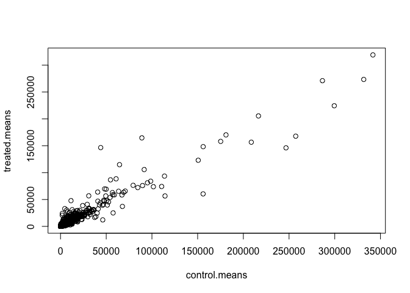
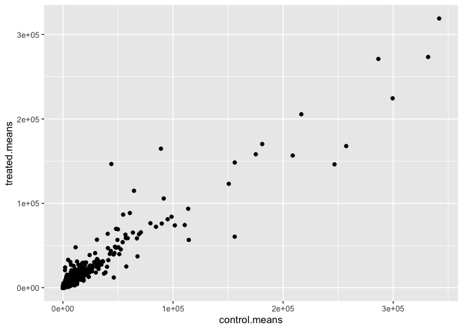
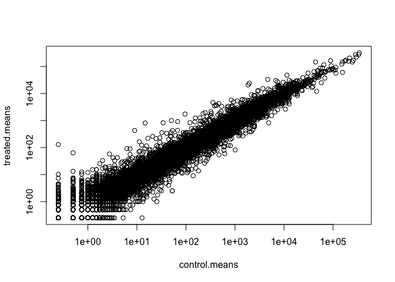
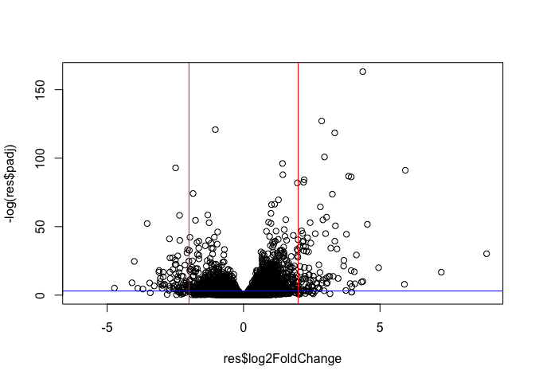

# Class12: RNASeq analysis
Junlin Ruan (PID: A17839687)

- [Background](#background)
- [Data Import](#data-import)
- [Toy differential gene expression](#toy-differential-gene-expression)
- [DESeq2 analysis](#deseq2-analysis)
- [Volcano Plot](#volcano-plot)
- [Save our results](#save-our-results)
- [Add gene annotation](#add-gene-annotation)
- [Pathway analysis](#pathway-analysis)
- [Save our main results](#save-our-main-results)

## Background

Today we will analyze some RNASeq data from Himes et al. on the effects
of a common steroid (dexamethasone) on airway smooth muscle cells (ASN
cells).

Are starting point is the “counts” data and “metadata” that contain the
count values for each gene in their different experiments (i.e. cell
lines with or without the drug).

## Data Import

``` r
# Complete the missing code
counts <- read.csv("airway_scaledcounts.csv", row.names=1)
metadata <- read.csv("airway_metadata.csv")
```

Let’s jave a wee peak at these objects:

``` r
head(counts)
```

                    SRR1039508 SRR1039509 SRR1039512 SRR1039513 SRR1039516
    ENSG00000000003        723        486        904        445       1170
    ENSG00000000005          0          0          0          0          0
    ENSG00000000419        467        523        616        371        582
    ENSG00000000457        347        258        364        237        318
    ENSG00000000460         96         81         73         66        118
    ENSG00000000938          0          0          1          0          2
                    SRR1039517 SRR1039520 SRR1039521
    ENSG00000000003       1097        806        604
    ENSG00000000005          0          0          0
    ENSG00000000419        781        417        509
    ENSG00000000457        447        330        324
    ENSG00000000460         94        102         74
    ENSG00000000938          0          0          0

> Q1. How many genes are in this dataset?

``` r
nrow(counts)
```

    [1] 38694

> Q. How many different experiments (columns in counts or rows in
> metadata) are there?

``` r
ncol(counts)
```

    [1] 8

``` r
nrow(metadata)
```

    [1] 8

``` r
metadata
```

              id     dex celltype     geo_id
    1 SRR1039508 control   N61311 GSM1275862
    2 SRR1039509 treated   N61311 GSM1275863
    3 SRR1039512 control  N052611 GSM1275866
    4 SRR1039513 treated  N052611 GSM1275867
    5 SRR1039516 control  N080611 GSM1275870
    6 SRR1039517 treated  N080611 GSM1275871
    7 SRR1039520 control  N061011 GSM1275874
    8 SRR1039521 treated  N061011 GSM1275875

> Q2. How many ‘control’ cell lines we have?

``` r
sum(metadata$dex == "control")
```

    [1] 4

## Toy differential gene expression

To start our analysis let’s calculate the mean counts for all genes in
the “control” experiments.

1.  Extract all “control” columns from the `counts` object
2.  Calculate the mean for all rows (i.e. genes) of these “control”
    columns

3-4. Do the same for “treated” 5. Compare these `countrol.mean` and
`treated.mean` values

``` r
control.ids <- metadata$dex == "control"
control.counts <- counts[ , control.ids]
```

> Q3. How would you make the above code in either approach more robust?
> Is there a function that could help here?

``` r
control.means <- rowMeans(control.counts)
```

> Q4. Follow the same procedure for the treated samples (i.e. calculate
> the mean per gene across drug treated samples and assign to a labeled
> vector called treated.mean)

``` r
treated.ids <- metadata$dex == "treated"
treated.counts <- counts[ , treated.ids]
treated.means <- rowMeans(treated.counts)
```

Store these together for ease of bookkeeping as `meancounts`

``` r
meancounts <- data.frame(control.means, treated.means)
head(meancounts)
```

                    control.means treated.means
    ENSG00000000003        900.75        658.00
    ENSG00000000005          0.00          0.00
    ENSG00000000419        520.50        546.00
    ENSG00000000457        339.75        316.50
    ENSG00000000460         97.25         78.75
    ENSG00000000938          0.75          0.00

> Q5 (a). Create a scatter plot showing the mean of the treated samples
> against the mean of the control samples.

Make a plot of control vs treated mean values for all genes

``` r
plot(meancounts)
```



> Q5 (b).You could also use the ggplot2 package to make this figure
> producing the plot below. What geom\_?() function would you use for
> this plot?

``` r
library(ggplot2)
ggplot(meancounts, aes(x = control.means, y = treated.means)) +
  geom_point()
```



> Q6. Try plotting both axes on a log scale. What is the argument to
> plot() that allows you to do this?

Make this a log log plot

``` r
plot(meancounts, log = "xy")
```

    Warning in xy.coords(x, y, xlabel, ylabel, log): 15032 x values <= 0 omitted
    from logarithmic plot

    Warning in xy.coords(x, y, xlabel, ylabel, log): 15281 y values <= 0 omitted
    from logarithmic plot



We often talk metrics like “log2 fold-change”

``` r
# treated/control
log2(10/10)
```

    [1] 0

``` r
log2(10/20)
```

    [1] -1

``` r
log2(20/10)
```

    [1] 1

``` r
log2(40/10)
```

    [1] 2

``` r
log2(10/40)
```

    [1] -2

let’s calculate the log2 fold change for our treated over control mean
counts.

``` r
meancounts$log2fc <- log2(meancounts$treated.means / meancounts$control.means)
```

``` r
head(meancounts)
```

                    control.means treated.means      log2fc
    ENSG00000000003        900.75        658.00 -0.45303916
    ENSG00000000005          0.00          0.00         NaN
    ENSG00000000419        520.50        546.00  0.06900279
    ENSG00000000457        339.75        316.50 -0.10226805
    ENSG00000000460         97.25         78.75 -0.30441833
    ENSG00000000938          0.75          0.00        -Inf

``` r
zero.vals <- which(meancounts[,1:2]==0, arr.ind=TRUE)

to.rm <- unique(zero.vals[,1])
mycounts <- meancounts[-to.rm,]
head(mycounts)
```

                    control.means treated.means      log2fc
    ENSG00000000003        900.75        658.00 -0.45303916
    ENSG00000000419        520.50        546.00  0.06900279
    ENSG00000000457        339.75        316.50 -0.10226805
    ENSG00000000460         97.25         78.75 -0.30441833
    ENSG00000000971       5219.00       6687.50  0.35769358
    ENSG00000001036       2327.00       1785.75 -0.38194109

> Q7. What is the purpose of the arr.ind argument in the which()
> function call above? Why would we then take the first column of the
> output and need to call the unique() function?

The arr.ind=TRUE argument will clause which() to return both the row and
column indices (i.e. positions) where there are TRUE values. Calling
unique() will ensure we don’t count any row twice if it has zero entries
in both samples.

A common “rule of thumb” is a log2 fold change cutoff of +2 and -2 to
call genes “Up regulated” or “Down regulated”.

Number of “up” genes

``` r
sum(meancounts$log2fc >= +2, na.rm = T)
```

    [1] 1910

Number of “down” genes at -2 threshold

``` r
sum(meancounts$log2fc <= -2, na.rm = T)
```

    [1] 2330

> Q8. Using the up.ind vector above can you determine how many up
> regulated genes we have at the greater than 2 fc level? Q9. Using the
> down.ind vector above can you determine how many down regulated genes
> we have at the greater than 2 fc level?

``` r
up.ind <- meancounts$log2fc > 2
down.ind <- meancounts$log2fc < (-2)
sum(up.ind, na.rm = T)
```

    [1] 1846

``` r
sum(down.ind, na.rm = T)
```

    [1] 2212

> Q10. Do you trust these results? Why or why not?

Fold change can be large (e.g. \>\>two-fold up- or down-regulation)
without being statistically significant (e.g. based on p-values). So we
have to determine if the differences are significant first before
drawing conclusions.

## DESeq2 analysis

Let’s do this analysis properly and keep our inner stats nerd happy -
i.e. are the differences we see between drug and no drug significant
given the replicate experiments.

``` r
library(DESeq2)
```

For DESeq analysis we need three things

- count values (`contData`)
- metadata telling us about the columns in `countData` (`colData`)
- design of the experiment (i.e. what do you want to compare)

Our first function from DESeq2 will setup the input required for
analysis by storing all these 3 things together.

``` r
dds <- DESeqDataSetFromMatrix(countData = counts,
                              colData = metadata,
                              design = ~dex)
```

    converting counts to integer mode

    Warning in DESeqDataSet(se, design = design, ignoreRank): some variables in
    design formula are characters, converting to factors

The main function in DESeq2 that runs the analysis is called `DESeq()`

``` r
dds <- DESeq(dds)
```

    estimating size factors

    estimating dispersions

    gene-wise dispersion estimates

    mean-dispersion relationship

    final dispersion estimates

    fitting model and testing

``` r
res <- results(dds)
head(res)
```

    log2 fold change (MLE): dex treated vs control 
    Wald test p-value: dex treated vs control 
    DataFrame with 6 rows and 6 columns
                      baseMean log2FoldChange     lfcSE      stat    pvalue
                     <numeric>      <numeric> <numeric> <numeric> <numeric>
    ENSG00000000003 747.194195      -0.350703  0.168242 -2.084514 0.0371134
    ENSG00000000005   0.000000             NA        NA        NA        NA
    ENSG00000000419 520.134160       0.206107  0.101042  2.039828 0.0413675
    ENSG00000000457 322.664844       0.024527  0.145134  0.168996 0.8658000
    ENSG00000000460  87.682625      -0.147143  0.256995 -0.572550 0.5669497
    ENSG00000000938   0.319167      -1.732289  3.493601 -0.495846 0.6200029
                         padj
                    <numeric>
    ENSG00000000003  0.163017
    ENSG00000000005        NA
    ENSG00000000419  0.175937
    ENSG00000000457  0.961682
    ENSG00000000460  0.815805
    ENSG00000000938        NA

## Volcano Plot

This is common summary result figure from these types of experiments and
plot the log2 fold-change vs the adjusted p-value.

``` r
plot(res$log2FoldChange, -log(res$padj))
abline(v = c(-2,2), col = "red")
abline(h = -log(0.05), col = "blue")
```



## Save our results

``` r
write.csv(res, file="my_results.csv")
```

## Add gene annotation

To help make sense of our results and communicate them to other folks we
need to add some more annotation to our main `res` object.

We will use two bioconductor packages to first map IDs to different
formats including the classic gene “symbol” gene name.

I will install these with the following commands:
`BiocManager::install("AnnotationDbi")`
`BiocManager::install("org.Hs.eg.db")`

``` r
library(AnnotationDbi)
library(org.Hs.eg.db)
```

Let’s see what is in `org.Hs.eg.db` with the `columns()` function:

``` r
columns(org.Hs.eg.db)
```

     [1] "ACCNUM"       "ALIAS"        "ENSEMBL"      "ENSEMBLPROT"  "ENSEMBLTRANS"
     [6] "ENTREZID"     "ENZYME"       "EVIDENCE"     "EVIDENCEALL"  "GENENAME"    
    [11] "GENETYPE"     "GO"           "GOALL"        "IPI"          "MAP"         
    [16] "OMIM"         "ONTOLOGY"     "ONTOLOGYALL"  "PATH"         "PFAM"        
    [21] "PMID"         "PROSITE"      "REFSEQ"       "SYMBOL"       "UCSCKG"      
    [26] "UNIPROT"     

We can translate or “map” IDs between any of these 26 databases using
the `mapIds()` function.

``` r
res$symbol <- mapIds(keys = row.names(res), # our current IDs
                     keytype = "ENSEMBL",   # the format of our IDs
                     x = org.Hs.eg.db,      # where to get the mappings from
                     column = "SYMBOL")      # the format/DB to map to
```

    'select()' returned 1:many mapping between keys and columns

``` r
head(res)
```

    log2 fold change (MLE): dex treated vs control 
    Wald test p-value: dex treated vs control 
    DataFrame with 6 rows and 7 columns
                      baseMean log2FoldChange     lfcSE      stat    pvalue
                     <numeric>      <numeric> <numeric> <numeric> <numeric>
    ENSG00000000003 747.194195      -0.350703  0.168242 -2.084514 0.0371134
    ENSG00000000005   0.000000             NA        NA        NA        NA
    ENSG00000000419 520.134160       0.206107  0.101042  2.039828 0.0413675
    ENSG00000000457 322.664844       0.024527  0.145134  0.168996 0.8658000
    ENSG00000000460  87.682625      -0.147143  0.256995 -0.572550 0.5669497
    ENSG00000000938   0.319167      -1.732289  3.493601 -0.495846 0.6200029
                         padj      symbol
                    <numeric> <character>
    ENSG00000000003  0.163017      TSPAN6
    ENSG00000000005        NA        TNMD
    ENSG00000000419  0.175937        DPM1
    ENSG00000000457  0.961682       SCYL3
    ENSG00000000460  0.815805       FIRRM
    ENSG00000000938        NA         FGR

Add the mappings for “GENENAME” and “ENTREZID” and store as
`res$genename` and `res$entrez`

``` r
res$genename <- mapIds(keys = row.names(res), 
                     keytype = "ENSEMBL",
                     x = org.Hs.eg.db, 
                     column = "GENENAME") 
```

    'select()' returned 1:many mapping between keys and columns

``` r
res$entrez <- mapIds(keys = row.names(res), 
                     keytype = "ENSEMBL",
                     x = org.Hs.eg.db, 
                     column = "ENTREZID") 
```

    'select()' returned 1:many mapping between keys and columns

``` r
head(res)
```

    log2 fold change (MLE): dex treated vs control 
    Wald test p-value: dex treated vs control 
    DataFrame with 6 rows and 9 columns
                      baseMean log2FoldChange     lfcSE      stat    pvalue
                     <numeric>      <numeric> <numeric> <numeric> <numeric>
    ENSG00000000003 747.194195      -0.350703  0.168242 -2.084514 0.0371134
    ENSG00000000005   0.000000             NA        NA        NA        NA
    ENSG00000000419 520.134160       0.206107  0.101042  2.039828 0.0413675
    ENSG00000000457 322.664844       0.024527  0.145134  0.168996 0.8658000
    ENSG00000000460  87.682625      -0.147143  0.256995 -0.572550 0.5669497
    ENSG00000000938   0.319167      -1.732289  3.493601 -0.495846 0.6200029
                         padj      symbol               genename      entrez
                    <numeric> <character>            <character> <character>
    ENSG00000000003  0.163017      TSPAN6          tetraspanin 6        7105
    ENSG00000000005        NA        TNMD            tenomodulin       64102
    ENSG00000000419  0.175937        DPM1 dolichyl-phosphate m..        8813
    ENSG00000000457  0.961682       SCYL3 SCY1 like pseudokina..       57147
    ENSG00000000460  0.815805       FIRRM FIGNL1 interacting r..       55732
    ENSG00000000938        NA         FGR FGR proto-oncogene, ..        2268

## Pathway analysis

There are lots of bioconductor packages to do this type of analysis. For
now let’s just try one called **gauge** again we need ot install this if
we don’t have it already.

``` r
library(gage)
library(gageData)
library(pathview)
```

To use **gage** I need two things

- a named vector of fold-change values for our DEGs (our geneset of
  interest)
- a set of pathways or genesets to use for annotation

``` r
x <- c("barry" = 5, "lisa" = 10)
x
```

    barry  lisa 
        5    10 

``` r
names(x) <- c("low", "high")
x
```

     low high 
       5   10 

``` r
foldchanges <- res$log2FoldChange
names(foldchanges) <- res$entrez
head(foldchanges)
```

           7105       64102        8813       57147       55732        2268 
    -0.35070296          NA  0.20610728  0.02452701 -0.14714263 -1.73228897 

``` r
data("kegg.sets.hs")

keggres = gage(foldchanges, gsets = kegg.sets.hs)
```

In our results object we have:

``` r
attributes(keggres)
```

    $names
    [1] "greater" "less"    "stats"  

``` r
head(keggres$less, 5)
```

                                                             p.geomean stat.mean
    hsa05332 Graft-versus-host disease                    0.0004250607 -3.473335
    hsa04940 Type I diabetes mellitus                     0.0017820379 -3.002350
    hsa05310 Asthma                                       0.0020046180 -3.009045
    hsa04672 Intestinal immune network for IgA production 0.0060434609 -2.560546
    hsa05330 Allograft rejection                          0.0073679547 -2.501416
                                                                 p.val      q.val
    hsa05332 Graft-versus-host disease                    0.0004250607 0.09053792
    hsa04940 Type I diabetes mellitus                     0.0017820379 0.14232788
    hsa05310 Asthma                                       0.0020046180 0.14232788
    hsa04672 Intestinal immune network for IgA production 0.0060434609 0.31387487
    hsa05330 Allograft rejection                          0.0073679547 0.31387487
                                                          set.size         exp1
    hsa05332 Graft-versus-host disease                          40 0.0004250607
    hsa04940 Type I diabetes mellitus                           42 0.0017820379
    hsa05310 Asthma                                             29 0.0020046180
    hsa04672 Intestinal immune network for IgA production       47 0.0060434609
    hsa05330 Allograft rejection                                36 0.0073679547

Let’s look at one of these pathways (hsa05310 Asthma) with our genes
colored up so we can see the overlap

``` r
pathview(pathway.id = "hsa05310", gene.data = foldchanges)
```

    'select()' returned 1:1 mapping between keys and columns

    Info: Working in directory /Users/junlinruan/Desktop/courses/BIMM143/bimm143_github/class12

    Info: Writing image file hsa05310.pathview.png

Add this pathway figure to our lab report


## Save our main results

``` r
write.csv(res, file = "myresults_annotated.csv")
```
