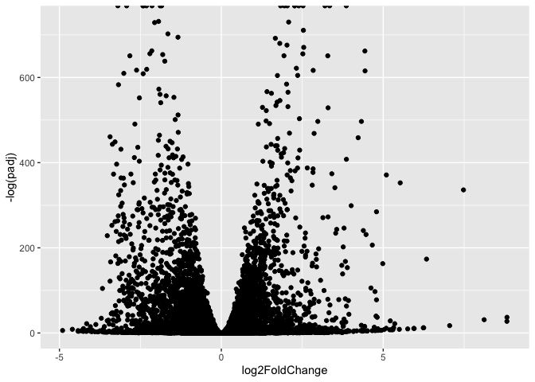
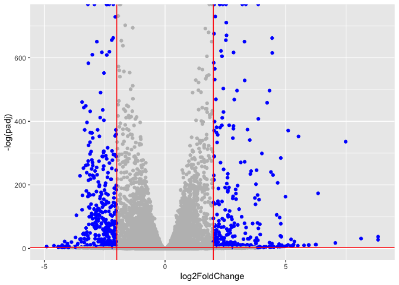

# Class 14: RNASeq mini project
Junlin Ruan (PID: A17839687)

- [Background](#background)
- [Data Import](#data-import)
  - [Remove zero count genes](#remove-zero-count-genes)
- [DESeq analysis](#deseq-analysis)
- [Data Visualization](#data-visualization)
- [Add Annotation](#add-annotation)
- [Pathway Analysis](#pathway-analysis)
  - [Reactome](#reactome)
- [Save Our Results](#save-our-results)

## Background

Here we work through a complete RNASeq analysis project. The input data
comes from a knock-down experiment of a HOX genes

## Data Import

Reading the `counts` and `metadata` CSV files

``` r
counts <- read.csv("GSE37704_featurecounts.csv", row.names = 1)
metadata <- read.csv("GSE37704_metadata.csv")
```

Check on data structure

``` r
head(counts)
```

                    length SRR493366 SRR493367 SRR493368 SRR493369 SRR493370
    ENSG00000186092    918         0         0         0         0         0
    ENSG00000279928    718         0         0         0         0         0
    ENSG00000279457   1982        23        28        29        29        28
    ENSG00000278566    939         0         0         0         0         0
    ENSG00000273547    939         0         0         0         0         0
    ENSG00000187634   3214       124       123       205       207       212
                    SRR493371
    ENSG00000186092         0
    ENSG00000279928         0
    ENSG00000279457        46
    ENSG00000278566         0
    ENSG00000273547         0
    ENSG00000187634       258

``` r
metadata
```

             id     condition
    1 SRR493366 control_sirna
    2 SRR493367 control_sirna
    3 SRR493368 control_sirna
    4 SRR493369      hoxa1_kd
    5 SRR493370      hoxa1_kd
    6 SRR493371      hoxa1_kd

Some book-keeping is required as there looks to be a mis-match between
metadata rows and counts columns

``` r
ncol(counts)
```

    [1] 7

``` r
nrow(metadata)
```

    [1] 6

Looks like we need to get rid of the first “length” column of our
`counts` object

> Q. Complete the code below to remove the troublesome first column from
> countData

``` r
cleancounts <- counts[,-1]
```

``` r
colnames(cleancounts)
```

    [1] "SRR493366" "SRR493367" "SRR493368" "SRR493369" "SRR493370" "SRR493371"

``` r
metadata$id
```

    [1] "SRR493366" "SRR493367" "SRR493368" "SRR493369" "SRR493370" "SRR493371"

``` r
all(colnames(cleancounts) == metadata$id)
```

    [1] TRUE

### Remove zero count genes

There are lots of genes with zero counts. We can remove these from
further analysis.

``` r
head(cleancounts)
```

                    SRR493366 SRR493367 SRR493368 SRR493369 SRR493370 SRR493371
    ENSG00000186092         0         0         0         0         0         0
    ENSG00000279928         0         0         0         0         0         0
    ENSG00000279457        23        28        29        29        28        46
    ENSG00000278566         0         0         0         0         0         0
    ENSG00000273547         0         0         0         0         0         0
    ENSG00000187634       124       123       205       207       212       258

> Q. Complete the code below to filter countData to exclude genes
> (i.e. rows) where we have 0 read count across all samples
> (i.e. columns).

``` r
to.keep.inds <- rowSums(cleancounts) > 0
nonzero_counts <- cleancounts[to.keep.inds,]
```

## DESeq analysis

Load the package

``` r
library(DESeq2)
```

Setup DESeq

``` r
dds <- DESeqDataSetFromMatrix(countData = nonzero_counts,
                              colData = metadata,
                              design = ~condition)
```

    Warning in DESeqDataSet(se, design = design, ignoreRank): some variables in
    design formula are characters, converting to factors

Run DESeq

``` r
dds <- DESeq(dds)
```

    estimating size factors

    estimating dispersions

    gene-wise dispersion estimates

    mean-dispersion relationship

    final dispersion estimates

    fitting model and testing

Get results

``` r
res <- results(dds)
```

> Q. Call the summary() function on your results to get a sense of how
> many genes are up or down-regulated at the default 0.1 p-value cutoff.

``` r
summary(res)
```


    out of 15975 with nonzero total read count
    adjusted p-value < 0.1
    LFC > 0 (up)       : 4349, 27%
    LFC < 0 (down)     : 4396, 28%
    outliers [1]       : 0, 0%
    low counts [2]     : 1237, 7.7%
    (mean count < 0)
    [1] see 'cooksCutoff' argument of ?results
    [2] see 'independentFiltering' argument of ?results

## Data Visualization

Volcano plot

``` r
library(ggplot2)

ggplot(res) +
  aes(log2FoldChange, -log(padj)) +
  geom_point() 
```

    Warning: Removed 1237 rows containing missing values or values outside the scale range
    (`geom_point()`).



> Q. Improve this plot by completing the below code, which adds color
> and axis labels

``` r
# Make a color vector for all genes
mycols <- rep("gray", nrow(res) )

# Color red the genes with absolute fold change above 2
mycols[ abs(res$log2FoldChange) > 2 ] <- "red"

# Color blue those with adjusted p-value less than 0.01
# and absolute fold change more than 2
inds <- (res$padj < 0.01) & (abs(res$log2FoldChange) > 2)
mycols[ inds ] <- "blue"

plot( res$log2FoldChange, -log(res$padj),
      col = mycols,
      xlab = "Log2(FoldChange)", ylab = "-Log(P-value)" )
```


Add threshold lines for fold-change and P-value and color our subset of
genes that make these threshold cut-offs in the plot

``` r
mycols <- rep("gray", nrow(res))
mycols[abs(res$log2FoldChange) > 2 & res$padj < 0.05] <- "blue"

ggplot(res) +
  aes(log2FoldChange, -log(padj), color = mycols) +
  geom_point() +
  geom_vline(xintercept = c(-2, 2), color = "red") +
  geom_hline(yintercept = -log(0.05), color = "red") +
  scale_color_identity()
```

    Warning: Removed 1237 rows containing missing values or values outside the scale range
    (`geom_point()`).



## Add Annotation

> Q. Use the mapIDs() function multiple times to add SYMBOL, ENTREZID
> and GENENAME annotation to our results by completing the code below.

Add some symbols and entrez ids

``` r
library(AnnotationDbi)
library(org.Hs.eg.db)
```

``` r
columns(org.Hs.eg.db)
```

     [1] "ACCNUM"       "ALIAS"        "ENSEMBL"      "ENSEMBLPROT"  "ENSEMBLTRANS"
     [6] "ENTREZID"     "ENZYME"       "EVIDENCE"     "EVIDENCEALL"  "GENENAME"    
    [11] "GENETYPE"     "GO"           "GOALL"        "IPI"          "MAP"         
    [16] "OMIM"         "ONTOLOGY"     "ONTOLOGYALL"  "PATH"         "PFAM"        
    [21] "PMID"         "PROSITE"      "REFSEQ"       "SYMBOL"       "UCSCKG"      
    [26] "UNIPROT"     

``` r
res$symbol <- mapIds(x = org.Hs.eg.db,
                     keys = row.names(res),
                     keytype = "ENSEMBL",
                     column = "SYMBOL")
```

    'select()' returned 1:many mapping between keys and columns

``` r
res$entrez <- mapIds(x = org.Hs.eg.db,
                     keys = row.names(res),
                     keytype = "ENSEMBL",
                     column = "ENTREZID")
```

    'select()' returned 1:many mapping between keys and columns

``` r
res$name <- mapIds(x = org.Hs.eg.db,
                     keys = row.names(res),
                     keytype = "ENSEMBL",
                     column = "GENENAME")
```

    'select()' returned 1:many mapping between keys and columns

> Q. Finally for this section let’s reorder these results by adjusted
> p-value and save them to a CSV file in your current project directory.

``` r
res = res[order(res$padj), ]
write.csv(res, file = "deseq_results.csv")
```

## Pathway Analysis

Run gene analysis

``` r
library(gage)
library(gageData)
library(pathview)
```

We need a named vector of fold-change values as input for gage

``` r
foldchanges <- res$log2FoldChange
names(foldchanges) <- res$entrez
head(foldchanges)
```

         1266     54855      1465      2034      2150      6659 
    -2.422719  3.201955 -2.313738 -1.888019  3.344508  2.392288 

``` r
data("kegg.sets.hs")

keggres = gage(foldchanges, gsets=kegg.sets.hs)
```

``` r
attributes(keggres)
```

    $names
    [1] "greater" "less"    "stats"  

``` r
head(keggres$less, 5)
```

                                                      p.geomean stat.mean
    hsa04110 Cell cycle                            8.995727e-06 -4.378644
    hsa03030 DNA replication                       9.424076e-05 -3.951803
    hsa05130 Pathogenic Escherichia coli infection 1.405864e-04 -3.765330
    hsa03013 RNA transport                         1.375901e-03 -3.028500
    hsa03440 Homologous recombination              3.066756e-03 -2.852899
                                                          p.val       q.val
    hsa04110 Cell cycle                            8.995727e-06 0.001889103
    hsa03030 DNA replication                       9.424076e-05 0.009841047
    hsa05130 Pathogenic Escherichia coli infection 1.405864e-04 0.009841047
    hsa03013 RNA transport                         1.375901e-03 0.072234819
    hsa03440 Homologous recombination              3.066756e-03 0.128803765
                                                   set.size         exp1
    hsa04110 Cell cycle                                 121 8.995727e-06
    hsa03030 DNA replication                             36 9.424076e-05
    hsa05130 Pathogenic Escherichia coli infection       53 1.405864e-04
    hsa03013 RNA transport                              144 1.375901e-03
    hsa03440 Homologous recombination                    28 3.066756e-03

``` r
pathview(pathway.id="hsa04110", gene.data=foldchanges)
```

    'select()' returned 1:1 mapping between keys and columns

    Info: Working in directory /Users/junlinruan/Desktop/courses/BIMM143/bimm143_github/class14

    Info: Writing image file hsa04110.pathview.png


``` r
pathview(pathway.id = "hsa03030", gene.data = foldchanges)
```

    'select()' returned 1:1 mapping between keys and columns

    Info: Working in directory /Users/junlinruan/Desktop/courses/BIMM143/bimm143_github/class14

    Info: Writing image file hsa03030.pathview.png

 \### Gene Ontology (GO) Same analysis but using GO
genesets rather than KEGG

``` r
data(go.sets.hs)
data(go.subs.hs)

# Focus on Biological Process subset of GO
gobpsets = go.sets.hs[go.subs.hs$BP]

gobpres = gage(foldchanges, gsets=gobpsets, same.dir=TRUE)

lapply(gobpres, head)
```

    $greater
                                                 p.geomean stat.mean        p.val
    GO:0007156 homophilic cell adhesion       8.519724e-05  3.824205 8.519724e-05
    GO:0002009 morphogenesis of an epithelium 1.396681e-04  3.653886 1.396681e-04
    GO:0048729 tissue morphogenesis           1.432451e-04  3.643242 1.432451e-04
    GO:0007610 behavior                       1.925222e-04  3.565432 1.925222e-04
    GO:0060562 epithelial tube morphogenesis  5.932837e-04  3.261376 5.932837e-04
    GO:0035295 tube development               5.953254e-04  3.253665 5.953254e-04
                                                  q.val set.size         exp1
    GO:0007156 homophilic cell adhesion       0.1951953      113 8.519724e-05
    GO:0002009 morphogenesis of an epithelium 0.1951953      339 1.396681e-04
    GO:0048729 tissue morphogenesis           0.1951953      424 1.432451e-04
    GO:0007610 behavior                       0.1967577      426 1.925222e-04
    GO:0060562 epithelial tube morphogenesis  0.3565320      257 5.932837e-04
    GO:0035295 tube development               0.3565320      391 5.953254e-04

    $less
                                                p.geomean stat.mean        p.val
    GO:0048285 organelle fission             1.536227e-15 -8.063910 1.536227e-15
    GO:0000280 nuclear division              4.286961e-15 -7.939217 4.286961e-15
    GO:0007067 mitosis                       4.286961e-15 -7.939217 4.286961e-15
    GO:0000087 M phase of mitotic cell cycle 1.169934e-14 -7.797496 1.169934e-14
    GO:0007059 chromosome segregation        2.028624e-11 -6.878340 2.028624e-11
    GO:0000236 mitotic prometaphase          1.729553e-10 -6.695966 1.729553e-10
                                                    q.val set.size         exp1
    GO:0048285 organelle fission             5.841698e-12      376 1.536227e-15
    GO:0000280 nuclear division              5.841698e-12      352 4.286961e-15
    GO:0007067 mitosis                       5.841698e-12      352 4.286961e-15
    GO:0000087 M phase of mitotic cell cycle 1.195672e-11      362 1.169934e-14
    GO:0007059 chromosome segregation        1.658603e-08      142 2.028624e-11
    GO:0000236 mitotic prometaphase          1.178402e-07       84 1.729553e-10

    $stats
                                              stat.mean     exp1
    GO:0007156 homophilic cell adhesion        3.824205 3.824205
    GO:0002009 morphogenesis of an epithelium  3.653886 3.653886
    GO:0048729 tissue morphogenesis            3.643242 3.643242
    GO:0007610 behavior                        3.565432 3.565432
    GO:0060562 epithelial tube morphogenesis   3.261376 3.261376
    GO:0035295 tube development                3.253665 3.253665

``` r
head(gobpres$less, 4)
```

                                                p.geomean stat.mean        p.val
    GO:0048285 organelle fission             1.536227e-15 -8.063910 1.536227e-15
    GO:0000280 nuclear division              4.286961e-15 -7.939217 4.286961e-15
    GO:0007067 mitosis                       4.286961e-15 -7.939217 4.286961e-15
    GO:0000087 M phase of mitotic cell cycle 1.169934e-14 -7.797496 1.169934e-14
                                                    q.val set.size         exp1
    GO:0048285 organelle fission             5.841698e-12      376 1.536227e-15
    GO:0000280 nuclear division              5.841698e-12      352 4.286961e-15
    GO:0007067 mitosis                       5.841698e-12      352 4.286961e-15
    GO:0000087 M phase of mitotic cell cycle 1.195672e-11      362 1.169934e-14

### Reactome

Lots of folks like the reactome web interface,. You can also run this as
an R funciton but lets look at the website first. \<
https://reactome.org/ \>

The website wants a text file wit one gene symbol per line of the genes
you want to map to pathways.

``` r
sig_genes <- res[res$padj <= 0.05 & !is.na(res$padj), ]$symbol
head(sig_genes) #res$symbo
```

    ENSG00000117519 ENSG00000183508 ENSG00000159176 ENSG00000116016 ENSG00000164251 
             "CNN3"        "TENT5C"         "CSRP1"         "EPAS1"         "F2RL1" 
    ENSG00000124766 
             "SOX4" 

and write out to a file”

``` r
write.table(sig_genes, file="significant_genes.txt", row.names=FALSE, col.names=FALSE, quote=FALSE)
```

## Save Our Results

``` r
write.csv(res, file="myresults.csv")
```
